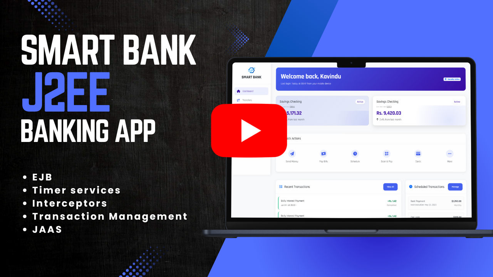

#Smart Bank - Enterprise Banking System (J2EE)

## Overview
**Smart Bank** is a **J2EE-based enterprise banking system** built to demonstrate advanced backend development skills for **secure, scalable, and transactionally consistent financial applications**.  
The project is packaged as an **EAR (Enterprise Archive)** with multiple modules for clear separation of concerns, following best practices in **enterprise architecture design**.

### Key Functionalities

**User-Side**
- Transfer funds between own accounts (**internal transfers**).
- Transfer funds to other users (**external transfers**).
- Schedule future money transfers using **EJB Timer Service**.
- View **transaction history** grouped by date and account.
- View and manage **pending and past scheduled transactions**.

**Admin-Side**
- Register new users with initial deposit.
- Deposit money into user accounts.
- View registered users and accounts.

**Automated Operations**
- Apply **daily interest calculations** to all active accounts.
- Trigger **scheduled transfers** at the exact time set by the user.

The project focuses heavily on backend architecture, security, concurrency handling, and **time-sensitive EJB operations**.

> *Click the image below to watch the full walkthrough video.*

[](https://youtu.be/oRse2fLKgzI?si=Sd45Vkean52HwN7g)
</br></br>


---

## 🚀 Key Backend Features
### 🏦 Core Banking Operations
- **Internal & External Fund Transfers** with transaction integrity.
- **Scheduled Transactions** using EJB **Timer Services**.
- **Daily Interest Calculation** using `@Schedule` for automated batch jobs.
- **Account Management** (Admin-controlled user registration, deposits).

### ⚙️ Enterprise Java Technologies
- **EJB (Enterprise JavaBeans)**  
  - `@Stateless`, `@Singleton`, and `@Startup` beans for business logic.
  - **Timer Service Integration** for recurring & scheduled tasks.
- **JPA (Java Persistence API)**  
  - Entity mapping for `Account`, `Transaction`, `User`, `ScheduledTransfer`, etc.
  - **Pessimistic Locking** for concurrency control.
- **Transaction Management**
  - Declarative transactions with `@TransactionAttribute(REQUIRED)`.
  - Rollback handling with `@ApplicationException`.
- **Interceptors**
  - Custom `AuditLogInterceptor` for centralized logging.

### 🔐 Security & Authorization
- **Java EE Security API (JSR 375)** with:
  - `HttpAuthenticationMechanism` for login handling.
  - `IdentityStore` for credential validation.
  - OTP verification for secure user authentication.
- **Role-Based Access Control (RBAC)**:
  - `@RolesAllowed("ADMIN")` & `@RolesAllowed("USER")` for EJB methods.
  - Container-managed security via `web.xml`.
- **Programmatic Authorization** for sensitive operations.

---

## 🏗️ Project Architecture
```
smart-bank-ear/
├── core/         # Entities, DTOs, Interceptors, Exceptions, Services
├── transaction/  # Transaction EJBs, Timer Services
├── user/         # User-related EJBs & queries
├── web/          # Servlets, JSPs, Auth Mechanism
├── admin/        # Admin-specific operations
└── auth/         # Authentication & OTP logic
```

---

## 📊 Database Design
- **Entities**: User, Account, Transaction, ScheduledTransfer, InterestRecord.
- **Named Queries** for optimized data access.
- **Locking Strategies** to prevent race conditions in transactions.

---

## 🧪 Testing & Reliability
- Functional testing via **Postman** for REST endpoints.
- Load & performance testing using **JMeter**.
- Transaction reliability testing for high-concurrency scenarios.
- Timer tasks monitored through application server logs and manual validation.

---

## 🛠️ Technologies & Tools
- **Backend**: Java EE (EJB, JPA, CDI, JSR 375 Security)
- **Application Server**: GlassFish / Payara
- **Database**: MySQL / PostgreSQL
- **Build Tool**: Maven
- **Testing**: JUnit, Postman, JMeter
- **Version Control**: Git / GitHub

---

## 🎯 Key Backend Skills Demonstrated
- Enterprise architecture design with **modular EAR packaging**.
- **EJB Timer Services** for automated banking operations.
- **Declarative transaction management** with rollback control.
- **Advanced security integration** with role-based access & OTP verification.
- **Concurrency handling** with pessimistic locking.
- **Audit logging** via EJB interceptors.

---

## Disclaimer

**This project is part of my professional portfolio. You’re welcome to reference it, but please credit me if you reuse or adapt any part of it.**

## License

This project is licensed under the [MIT License](LICENSE.md).
